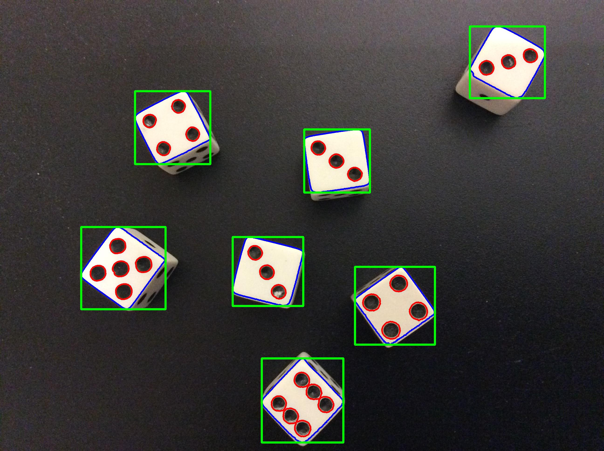
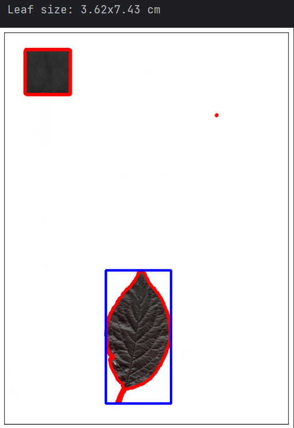
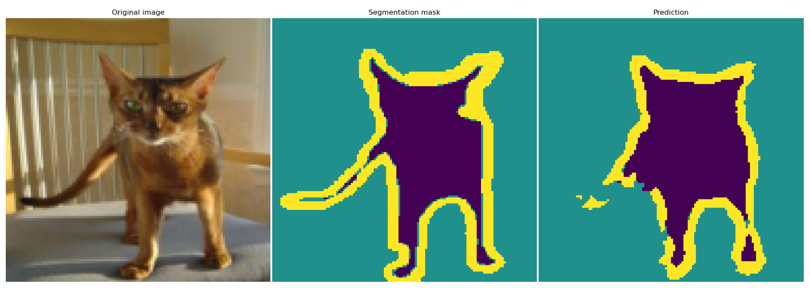

# Image Processing

My replica of [foobar167's replica](https://colab.research.google.com/drive/1M6j5FyqwQtAe85RtbOXkqjQldY8eoT7a)
of the [Image Processing with Python](https://datacarpentry.org/image-processing/) course by Datacarpentry.

<!---->

# Image Segmentation
[Image Segmentation model](https://www.kaggle.com/code/mmeshok/oxfordiiitpet) for OxfordIIITPet dataset,
made with Torch using U-Net architecture. Homework for karpov.cources.

# Decision Tree from scratch
[DecisionTreeRegressor](https://github.com/mmeshok/for_resume/tree/main/trees) written only using `python` and `numpy`.

# Gradient Boosting Regressor
[Gradient Boosting Regressor](https://github.com/mmeshok/for_resume/tree/main/trees) written using `sklearn.tree.DecisionTreeRegressor` and `numpy`.

# Dwarf Tavern
[Homework](https://github.com/mmeshok/for_resume/tree/main/dwarf_tavern) for ML Start (Interviews_6). Predict the probability of tavern client's default.